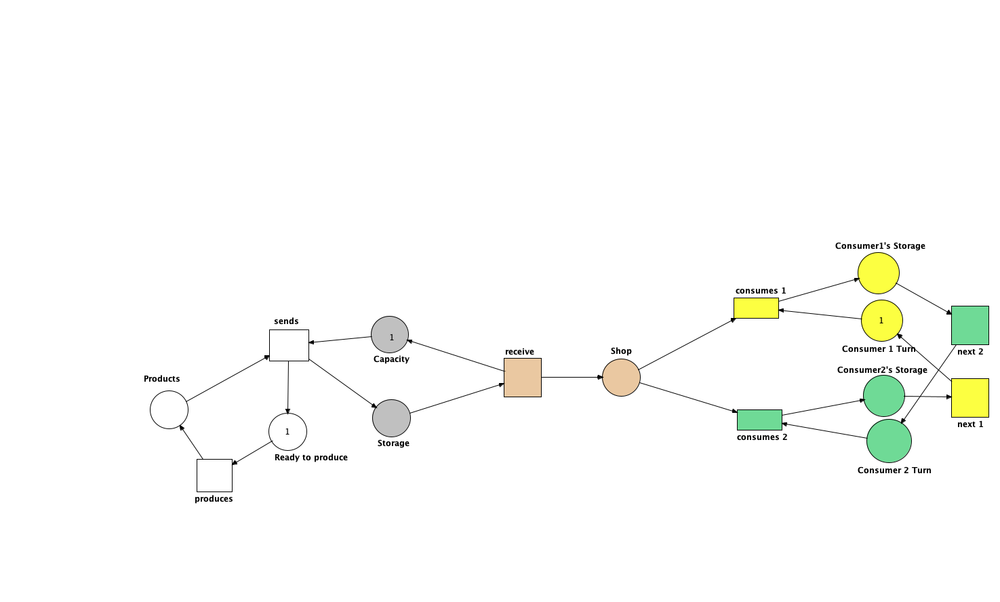

# Model-based_development

Here tasks performed within the subject as well as final project are collected.

# Content
- ### [Task 1: Model using a Place/Transition Petri net for online purchasing train tickets system](https://github.com/DariaMartinovskaya/Model-based_development/blob/main/README.md#task-1-model-using-a-placetransition-petri-net-for-online-purchasing-train-tickets-system-1)

- ### [Task 2: RENEW models: Alternating Consumers & Sequential Stores with Multiple Consumers](https://github.com/DariaMartinovskaya/Model-based_development/blob/main/README.md#task-2-renew-models-alternating-consumers--sequential-stores-with-multiple-consumers-1)

- ### [Task 3: RENEW models: Producer-Consumer System with Modular Structure](https://github.com/DariaMartinovskaya/Model-based_development/edit/main/README.md#task-3-producer-consumer-system-with-modular-structure-1)

# Task 1: Model using a Place/Transition Petri net for online purchasing train tickets system 

This model presents a Place/Transition Petri net model representing the online train ticket purchase process. The model captures key steps of a typical user journey when purchasing a train ticket through an online platform.

### It includes:

Synchronization: at the point of searching for a trip, requiring destination, date/time, and travel class to be selected.

Parallelism: during the final booking step, where the system both books the trip and generates the ticket simultaneously.

### Model Overview

Places (P):

P1 – Start (decision to buy a ticket)

P2 – Destination is selected

P3 – Date and Time are selected

P4 – Travel class is selected

P5 – Trip is found

P6 – Passenger’s Data is completed

P7 – Payment is accepted

P8 – Trip is booked

P9 – Ticket is generated

Transitions (T):

T1 – Select trip details

T2 – Find a trip (synchronization: requires P2, P3, and P4)

T3 – Fill in Passenger’s Data

T4 – Upload ID

T5 – Select payment method

T6 – Make Payment

T7 – Finish a booking (parallelism: leads to both P8 and P9)

### Features

Synchronization (T2): Ensures the user has entered all required search parameters (destination, date/time, travel class) before proceeding.

Parallelism (T7): Once payment is completed, both ticket generation and trip booking occur simultaneously.

# Task 2: RENEW models: Alternating Consumers & Sequential Stores with Multiple Consumers 

These two exercises were modeled using the Reference Net Workshop (RNW) tool, each saved in the corresponding .rnw file and submitted in a ZIP archive as required.

### Exercise 1 – Alternating Consumers 

This model enforces alternating access to a shared storage between two consumers.

Only one consumer can retrieve a resource at a time.

After consuming, the current consumer passes control ("the baton") to the other.

This ensures strict alternation, preventing the same consumer from consuming twice in a row.

<a href="MBDTask2.1.rnw">Source rnw model.</a>

### Exercise 2 – Sequential Stores with Multiple Consumers 

This model introduces:

Two sequential storage places, each with a capacity of one.

A resource must move from the first store to the second before being eligible for consumption.

After the resource reaches the second store, any of three consumers can consume it (non-deterministic selection).

<a href="MBDTask2.2.rnw">Source rnw model.</a>

# Task 3: Producer-Consumer System with Modular Structure

Model objective: Build a flexible, modular producer-consumer system with synchronization and message passing using uplinks and downlinks.

### Exercise 1 – Scalable Producer-Consumer Model

Model: A generalized producer-consumer system with:

5 producers: represented as tokens like ["producer", 1] to ["producer", 5]

3 consumers: ["consumer", 1] to ["consumer", 3]

Scalability: Model graph remains unchanged regardless of the number of producers or consumers—only token counts change.

Mechanism: Producers create products and send them to a shared storage; consumers receive and consume products.

### Exercise 2 – Ordered Consumption (Round-Robin)

Extension: Consumers consume in a fixed circular order:

Consumer 1

Consumer 2

Consumer 3

Back to Consumer 1

Implementation: A circular counter controls access, enforcing strict consumption order.

<a href="MBDTask3.1-3.2.rnw">Source rnw model.</a>

### Exercise 3 – Modular System with Uplinks/Downlinks

Modularization: Model is divided into three disconnected subnets:

Production Module:

Producers generate products and send them to storage via uplink put.

Tokens format: ["producer", N, "a product"]

Storage Module:

Stores items in slots (capacity 5).

Handles incoming items via uplink :s(...).

Forwards items to consumers via downlink get.

Consumption Module:

Receives products via downlink get.

Consumers only consume products matching their ID, enforcing correct delivery.

Uses matching logic: consumer can only consume if consumer ID == product ID.

This RNW model implements:

Scalable production and consumption logic.

Ordered consumer execution using a circular counter.

Clear separation of concerns via modular Petri nets with uplinks/downlinks.

Realistic simulation of a distributed producer-storage-consumer architecture.

<a href="MBDTask3.3.rnw">Source rnw model.</a>

# Task 4: Door Control System with Signal-Based Motor and Counter

Model requirements:

- A button controls a door that opens and closes. But you can also use two or three buttons.

- The button opens the door by switching on a motor. 

- The same button is used to close the door.

- The motor can operate in two directions and accepts three commands: "direction", "start" and "stop".

- Add a counter that works by incrementing the value of a range-type output signal. Note that you must enter a minimum and maximum value. Then add an output event that uses this output signal. Finally, add the output event to a transition.

- You must use at least one input signal and one input event.

<a href="MBDTask4_Automatic_door_DM_26610.pnml">Source rnw model.</a>
